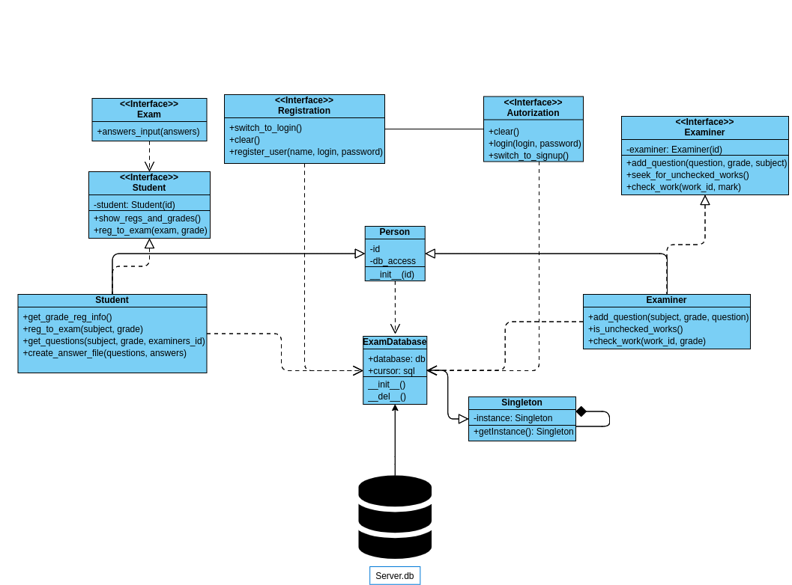

# DIST_EXAM
Проект представляет собой систему для дистанционной сдачи экзаменов. Перед пользователем открывается интерфейс авторизации, из которого он может перейти к регистрации (регистрация доступна только студентам, так как иначе регистрация экзаминаторов могла бы быть использована в корыстных целях студентами). У студентов имеется возможность просматривать свои регистрации и результаты экзаменов, в т.ч. количество пересдач, а также регистрироваться на экзамен. Для этого нужно ввести название экзамена и желаемую оценку(она будет в последующем пречислена к одной из групп(уд, хор, отл)), после чего, если всё корректно, экзамен не сдан и пересдач немного, то откроется интерфейс сдачи экзамена и будет предложено сохранить файл с вопросами. В интерфейсе сдачи нужно будет ввести ответы и нажать кнопку "Отправить", после чего работа сохранится и студент вернётся к интерфейсу регистрации.  
Экзаменаторы же могут добавлять вопросы по люыбм предметам, а также группам оценок(опять же они вводят оценку, а та пречисляется группе). Проверять наличие непроверенных ими работ, а также проверять сами работы и выставлять оценки.

## Запуск
Для запуска достаточно запустить `run.sh`, который установит нужные пакеты  
После чего запустить командку `python main.py`

## Тестирование
Для тестирования проекта в нём уже созданы учётные записи для студента(логин: *stud*, пароль: *123*) и экзаменатора(логин: *exam*, пароль *123*). Также для эказменатора добавлены по 3 вопроса в каждую категорию для предмета *MatAn*. И в папке *works* лежит одна работа.
## TODO
Features and improvements 

## Interfaces
`login_ui()` -- авторизационный интерфейс  
`signup_ui()` -- интерфейс регистрации  
`examiner_ui(id)` -- интерфейс экзаменатора, внутри интерфейсы для проверки работ и добавления вопросов  
`student_ui(id)` -- интерфейс студента, внутри интерфейс "зачётки" и регистрации на экзамен с последующим проведением
`answers_input()` -- интерфейс ввода ответов на вопросы

## UML

## Паттерны
**Singleton** -- использован для обеспечения доступа к базе данных  
**Фабрика** -- есть абстрактный класс `Person`, а от него два класса: `Student` и `Examiner`, которые позволяют работать с любыми студентами и экзаменаторами в зависимости от id
